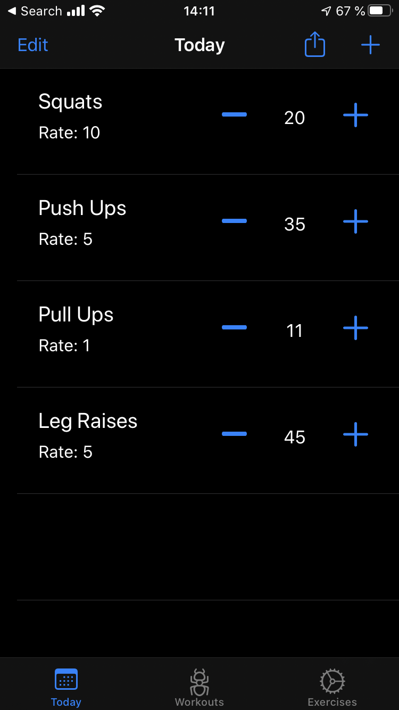
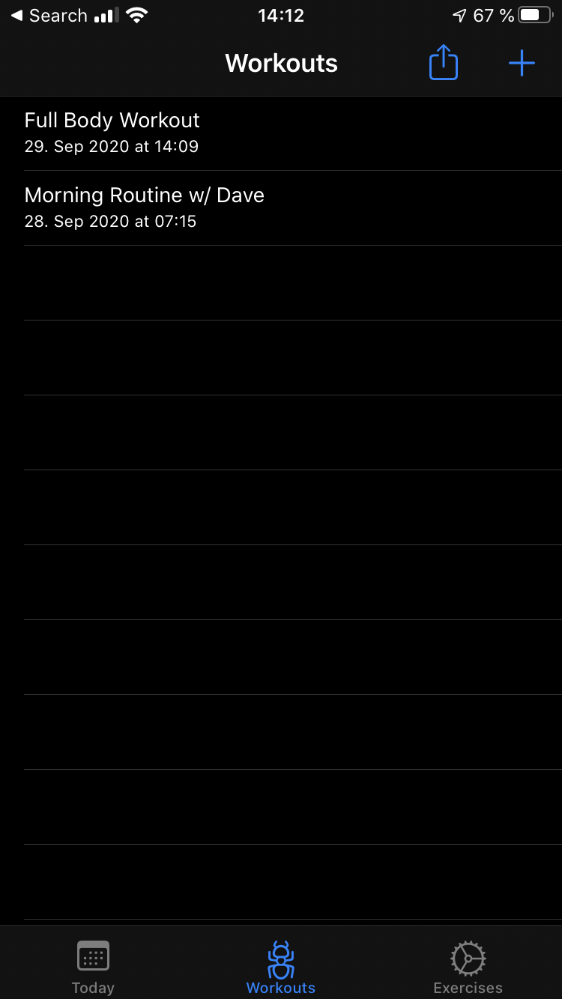
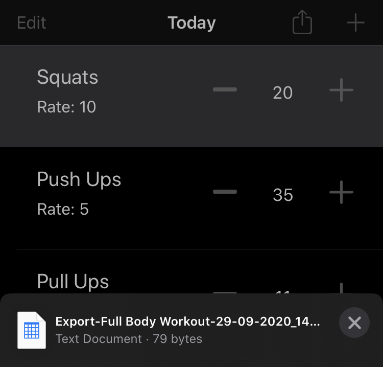
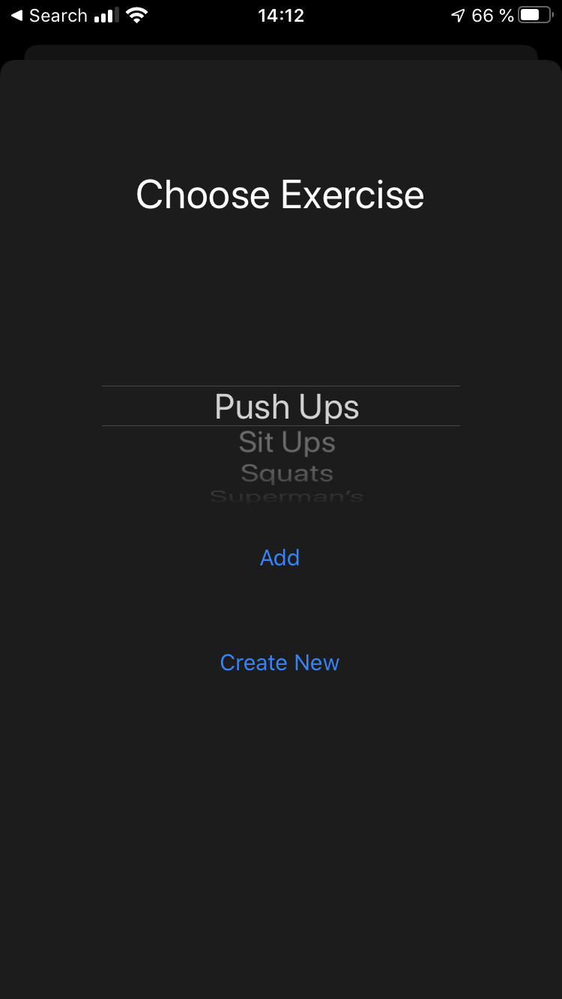

# WorkoutLogiOS

A simple workout logger for iOS platform to keep track of your daily workouts.

Fundamental functionalities:
* Add/Update/Remove Exercises
* Add/Update/Remove Workouts
* Easy way to modify the amount of repititions done for one exercise within one workout
* Export workouts as CSV-file

## Screenshots

